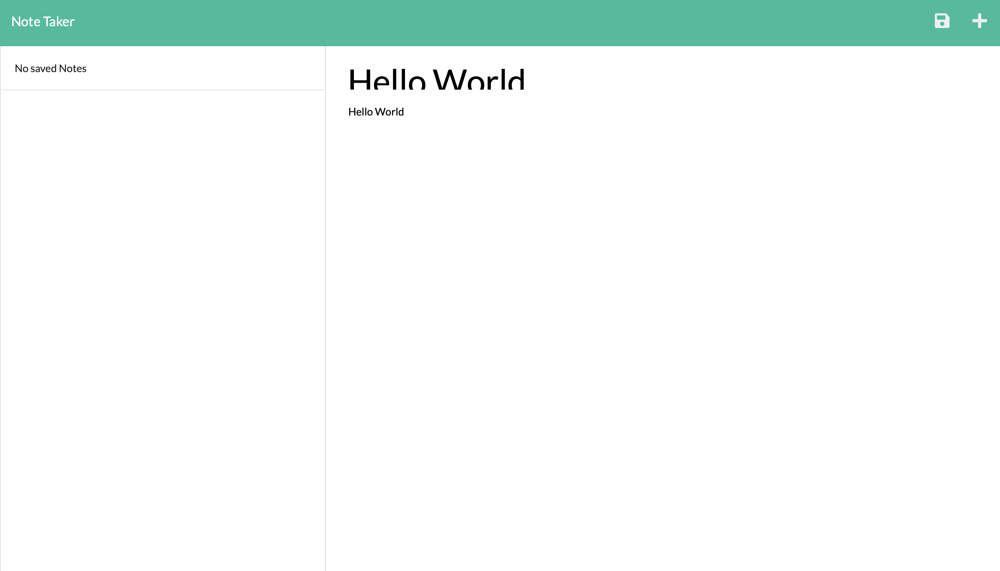
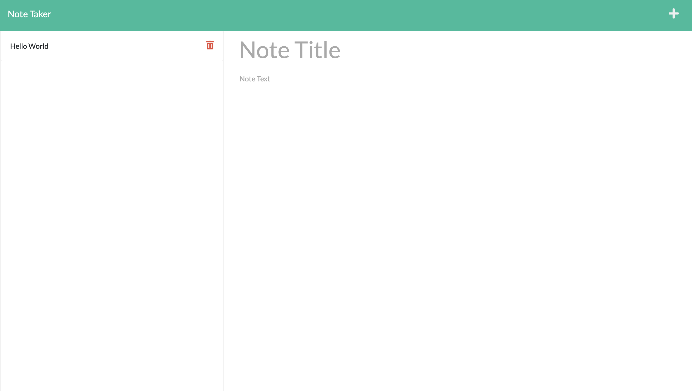

# Note Taker Project

## Description

This is a tool to make notes and saves them using Node.js and Express.js.  The application uses Express.js on the backend and saves the notes as a JSON.

## Deployment

This app has been deployed to Heroku and can be accessed at the following address:

[https://stormy-hollows-64576.herokuapp.com](https://stormy-hollows-64576.herokuapp.com)

### Screenshot

## Usage

To use the app, start by clicking the Get Started button on the homepage.  On the notes page, you will be presented with a list of saved notes on the left-hand side.  To open the note and see its details, click on the note.  To delete the note, click on the red trash icon next to it.  To add a new note, enter a note title and note text where prompted.  When you have entered something into both areas, a floppy disk icon will appear in the upper right of the screen.  Click it to save your note.