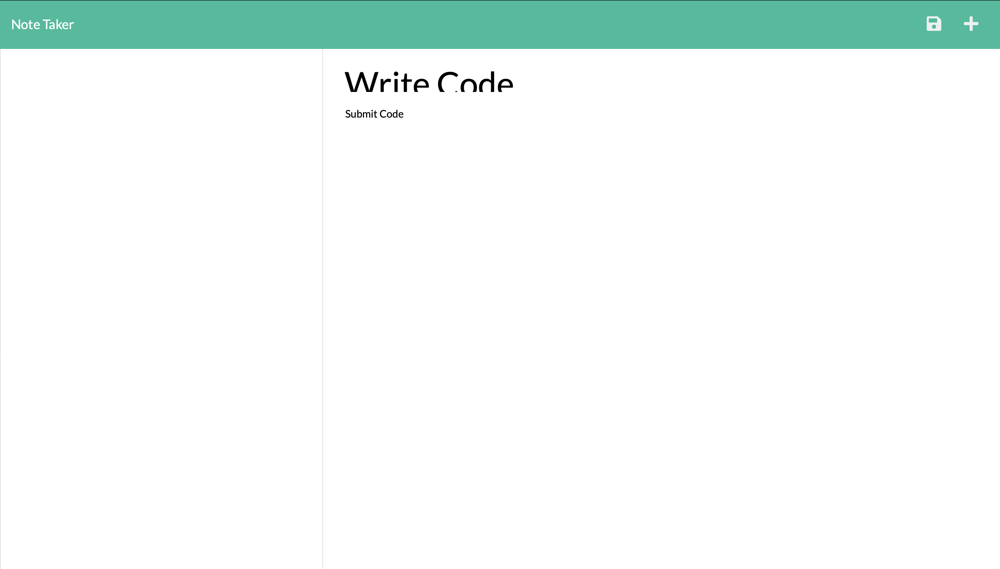

# Note Taker Project

## Description

This is a tool to make notes and saves them using Node.js and Express.js.  The application uses Express.js on the backend and saves the notes as a JSON.

## Deployment

[https://stormy-hollows-64576.herokuapp.com](https://stormy-hollows-64576.herokuapp.com)

## Screenshot

